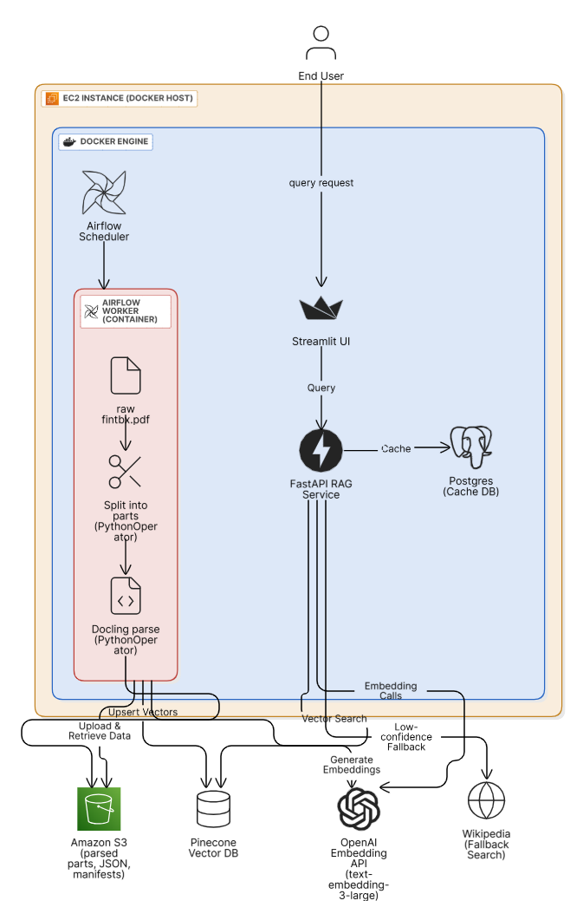

# 🧠 Project AURELIA: Financial Concept Extraction Pipeline  
**DAMG 7245 – Fall 2025 – Binary Insights**

## Overview
Automates the parsing, chunking, embedding, retrieval, and structured-note generation of financial concepts from the *Financial Toolbox User’s Guide (fintbx.pdf)*.  
Powered by **Apache Airflow**, **OpenAI GPT-4o**, **Docling**, **LangChain**, **Pinecone**, and **AWS S3**, all containerized and orchestrated on **AWS EC2 (Docker Host)** (Assignment 3 – Project AURELIA, n.d.).

## Setup Instructions

The pipeline integrates:
- **PDF Parsing & Chunking**
- **Semantic Embedding (OpenAI)**
- **Vector Search (Pinecone)**
- **Wikipedia Fallback**
- **Structured Note Generation (Instructor/OpenAI)**
- **Caching (PostgreSQL)**
- **Frontend (Streamlit)**
- **Orchestration (Airflow)**

---

## 1. Prerequisites
- Python 3.9+
- PostgreSQL (local or cloud)
- Pinecone account and index
- OpenAI API key
- All required Python packages (see `requirements.txt` or `requirements-docling.txt`)
- `.env` file with all secrets and credentials

---

## 2. Clone the Repository
```bash
git clone https://github.com/Binary-Insights/Assignment_03.git
cd Assignment_03
```

---

## 3. Configure Environment Variables
Create a `.env` file in the project root. Example:
```env
OPENAI_API_KEY=your-openai-key
PINECONE_API_KEY=your-pinecone-key
PINECONE_INDEX_NAME=your-pinecone-index
DB_HOST=localhost
DB_PORT=5432
DB_NAME=concept_db
DB_USER=postgres
DB_PASSWORD=your-db-password
LANGSMITH_API_KEY=your-langsmith-key
```

---

## 4. Install Python Dependencies
```bash
uv sync
# Or, for Docling features:
pip install -r requirements-docling.txt
```

---

## 5. Initialize the Database
Ensure PostgreSQL is running and the database exists. The backend will auto-create tables on first run.

---

## 6. Start the FastAPI Server
From the project root:
```bash
python run_fastapi.py
```
- Server runs at `http://localhost:8000`
- API docs: `http://localhost:8000/docs`

---

## 7. Test the API
- Open `http://localhost:8000/docs` in your browser
- Try endpoints like `/health`, `/query`, `/check-relevance`, `/concepts`

---

## 8. (Optional) Run the Streamlit Frontend
```bash
streamlit run src/frontend/rag_streamlit_frontend.py
```
- Set the API URL in the sidebar if needed.

---

## 9. (Optional) Docker Deployment
```bash
docker compose up --build
```

---


---

## 10. Troubleshooting
- Check `.env` for missing/incorrect keys
- Ensure PostgreSQL and Pinecone are accessible
- Review logs for errors

---

## 11. (Optional) Deploy on AWS EC2

1. **Launch an EC2 Instance**
	- Choose an instance type with ≥8GB RAM (e.g., t3.large).
	- Use Ubuntu or Amazon Linux for compatibility.
	- Attach your SSH key pair for secure access.

2. **Connect to EC2**
	```bash
	ssh -i /path/to/your-key.pem ubuntu@<EC2_PUBLIC_IP>
	```

3. **Install System Dependencies**
	```bash
	sudo apt update
	sudo apt install python3-pip git docker.io docker-compose -y
	```

4. **Clone the Repository**
	```bash
	git clone https://github.com/Binary-Insights/Assignment_03.git
	cd Assignment_03
	```

5. **Set Up Environment Variables**
	- Create your `.env` file as described above.

6. **Install Python Packages**
	```bash
	pip3 install -r requirements.txt
	```

7. **(Optional) Start with Docker**
	```bash
	sudo docker compose up --build
	```

8. **Run FastAPI Server**
	```bash
	python3 run_fastapi.py
	```

9. **Open Ports**
	- Ensure security group allows inbound traffic on ports 8000 (FastAPI), 8501 (Streamlit), 8080 (Airflow), etc.

10. **Access Services**
	 - FastAPI: `http://<EC2_PUBLIC_IP>:8000`
	 - Streamlit: `http://<EC2_PUBLIC_IP>:8501`
	 - Airflow: `http://<EC2_PUBLIC_IP>:8080`

---




## Folder Structure
```
data/
├── raw/
│   └── fintbx.pdf
├── parsed/
│   ├── part_001.json
│   ├── part_002.json
│   └── ...
├── embeddings/
│   └── pinecone_vectors/
├── dags/
│   ├── fintbx_ingest_dag.py
│   └── concept_seed_dag.py
├── services/
│   ├── fastapi_app/
│   └── streamlit_ui/
└── logs/
    └── airflow/
```

---

## Troubleshooting
| Issue | Resolution |
|:--|:--|
| **AWS credentials not found** | Verify `.env` and restart Docker containers. |
| **OpenAI API error** | Check key and usage limits in `.env`. |
| **Pinecone connection failed** | Confirm index name and region exist. |
| **Docling parse error** | Ensure Python dependencies match Docling 2.57 requirements. |
| **“Dag references non-existent pools”** | Create pool in Airflow UI → Admin → Pools or remove the pool reference. |


## Codelabs – Documentation
Access interactive documentation and tutorials for Project AURELIA:

[**Automating Financial Concept Extraction Pipeline**](https://codelabs-preview.appspot.com/?file_id=11KEFuXQkCkHAY6lqDIBsLace-moi5qR07OULxfLJguw#7)  
[**Video Demo**](https://drive.google.com/file/d/1swWunkqs5XKwevfJgRsEdYzTySKmG8Kz/view?usp=sharing)

---

## Attestation
WE ATTEST THAT WE HAVEN’T USED ANY OTHER STUDENTS’ WORK IN OUR ASSIGNMENT AND ABIDE BY THE POLICIES LISTED IN THE STUDENT HANDBOOK.

---


